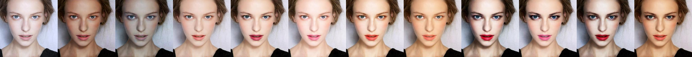

REF:https://github.com/Honlan/BeautyGAN

額外需要的套件
pip install imageio


###使用方式


方法1.  main.py --no_makeup <path>  產生多種風格拼接成的jpg，再搭配split.py --type_num <style_num> 切出想要的風格
       優點:選擇照片、生成合成圖後，可任意點選風格快速預覽
  
  
方法2.  test.py --no_makeup <path> --type_num <style_num> 直接完成一張選取的風格
       優點:呼叫一次py即可完成，生成單張速度較快
       缺點:瀏覽風格速度較慢


# BeautyGAN

### 简介

BeautyGAN: Instance-level Facial Makeup Transfer with Deep Generative Adversarial Network

官方网站：[http://liusi-group.com/projects/BeautyGAN](http://liusi-group.com/projects/BeautyGAN)

提供了论文和数据集，但是没有开源代码，也没有提供训练好的模型

### 复现效果



### 使用方法

- Python3.6
- TensorFlow1.9

下载训练好的模型

- [https://pan.baidu.com/s/1wngvgT0qzcKJ5LfLMO7m8A](https://pan.baidu.com/s/1wngvgT0qzcKJ5LfLMO7m8A)，7lip
- [https://drive.google.com/drive/folders/1pgVqnF2-rnOxcUQ3SO4JwHUFTdiSe5t9](https://drive.google.com/drive/folders/1pgVqnF2-rnOxcUQ3SO4JwHUFTdiSe5t9)

新建文件夹`model`，将模型文件放于其中

`imgs`中包括11张无妆图片，以及9张有妆图片

默认对`imgs/no_makeup/xfsy_0068.png`进行上妆

```
python main.py
```

如果需要对其他人脸图片上妆，传入图片路径即可，推荐使用大小合适的正脸图片

```
python main.py --no_makeup xxx.xxx
```
